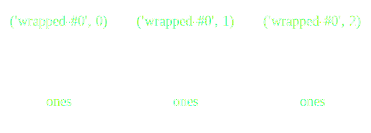
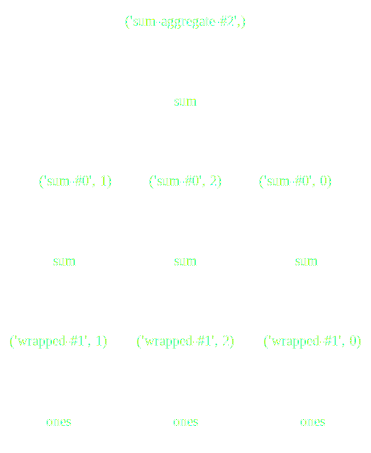
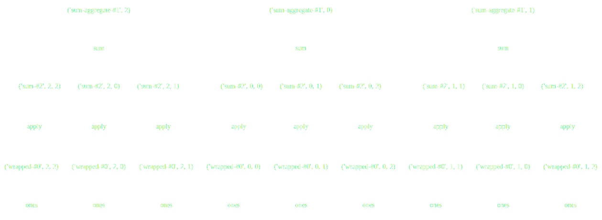
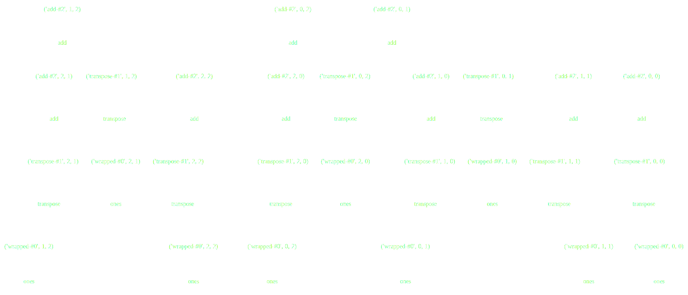

### Topics

- Python: Brief overview
- Jupyter: Cross-language project supporting interactive data science
- Pandas: High-performance data structures for data analysis in Python
- Dask: Flexible parallel computing

<aside class="notes">

This is a note

</aside>

### Goals

- *Not* to teach you Python
- Explore cross-language tools
- Compare and contrast, learn from each other

### A bit of History

- First release in 1991
- Popular as a "glue" language
- Benefiting from the rise of data science

### Trends

<section data-background-color="#fefefe">
  
</section>

### Jupyter

IPython: an interactive python shell

### Jupyter Notebook

{width=70%}

- A web application
- More importantly, a file format
- Enables things like nbviewer

### nbviewer

<iframe data-src="http://nbviewer.jupyter.org/" width="800" height="800"></iframe>

### Jupyter Messaging Protocol

{width=50%}

Kernels for > 50 languages (including R)

### IRKernel

*Demo*

### 

- Implements high-performance data structures for tabular data
- Many familiar operations (groupby, join)
- Handles missing data

### Pandas

*Demo*

### Dask

> - Python has a great, diverse ecosystem for scientific computing
> - but it's mostly restricted to a single core

### Collections, DAGs, and schedulers

- Take a familiar API
- Translate operations to a task graph
- Have smart schedulers execute the tasks

###

Dask Collections Build Task Graphs

---

Dask Schedulers Execute Task Graphs

### 1D-Array

    >>> np.ones((15,))
    array([ 1., 1., 1., 1., 1., 1., 1., 1., 1., 1., 1., 1., 1., 1., 1.])

    >>> x = da.ones((15,), chunks=(5,))

### 1D-Array

    x = da.ones((15,), chunks=(5,))
    x.sum()

### ND-Array - Sum

    x = da.ones((15, 15), chunks=(5, 5))
    x.sum(axis=0)

### ND-Array - Transpose

    x = da.ones((15, 15), chunks=(5, 5))
    x + x.T

### ND-Array - Matrix Multiply

    x = da.ones((15, 15), chunks=(5, 5))
    x.dot(x.T + 1)

### ND-Array - Compound Operations

    x = da.ones((15, 15), chunks=(5, 5))
    x.dot(x.T + 1) - x.mean()

### ND-Array - Compound Operations

    import dask.array as da
    x = da.ones((15, 15), chunks=(5, 5))
    y = (x.dot(x.T + 1) - x.mean()).std()

### Summary

- Jupyter for cross-language tools
- Pandas for high-performance data-structures
- Dask for parallelizing existing python workflows

### Thanks!
